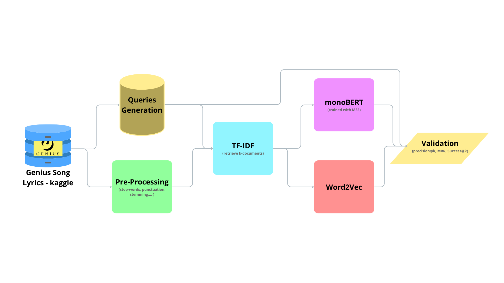

# Genius Lyrics Search
> Advanced Song Search Using Lyrics

## General info
We built an information retrieval pipeline that allows searching for a song using its lyrics.

This is a research project done as part of the course "Advanced Information Retrieval" at the Technical University of Graz.

## Data & Preprocessing

Documents (lyrics):
- We used the [Genius Song Lyrics Dataset](https://www.kaggle.com/datasets/carlosgdcj/genius-song-lyrics-with-language-information/) from Kaggle.
  - The 5 million songs take up over 9 GB of memory, so for our purposes, we had to limit ourselves to just 100k songs to make working with the dataset easier.
- We preprocessed the lyrics data by... 
  - taking only english songs
  - removing some corrupted lyrics
  - removing stopwords & punctuation
  - stemming the words

Queries & training data:
- We generated queries for the songs by randomly...
  - taking the first verses
  - or taking the first verses of the chorus
  - or taking some random verses.
- Queries were perturbed by randomly...
  - removing some words or letters,
  - switching letters,
  - introducing typos (of neighboring keys),
  - introducing common misspellings.

## Pipeline

1. Retrieval: **TF-IDF**
2. Re-ranking: **monoBERT** and **word2vec**  
Word2vec was not fully implemented.
3. Evaluation: **MRR**, **Hitrate@k**, **Precision@k**

## Results

In our limited testing, the model did not perform that well.
Since the word2vec implementation wasn't finished in time for the deadline, we only used monoBERT for re-ranking and could not compare it to the other re-ranker.

